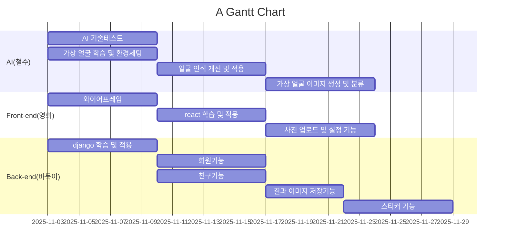

# 프로젝트 중간보고서

## 1. 프로젝트 개요 *필수작성

* 수행 학기:  
* 프로젝트명: 
* 작성날짜:    

구분 | 성명 | 학번 | 소속학과 | 깃허브 아이디
------|-------|-------|-------|-------
1 | 홍길동 | 202112345 | ㅇㅇㅇ학과 | abcdefghi@dongguk.edu         
2 |        |         |         |        
3 |        |         |         | 

* 지도교수: (소속)      (성명)      

## 2. 프로젝트 내용

### 2.1 서론

* 선택한 주제에 대해 잘 이해하고 학생 팀의 아이디어를 포함하여 개략적인 설명을 해야한다.  
* 프로젝트의 주제는 무엇인지 대략적인 설명과 해당 주제를 선정하게 된 배경, 해당 프로젝트의 필요성 및 해결 방향 등을 간략히 소개한다.  
* 또한, 달성하고자 하는 목적과 설계하고자 하는 최종 결과가 무엇인지 분명히 드러나도록 상세하게 기술한다.  

### 2.2 추진 배경(자료조사 및 요구분석)  

#### 2.2.1. 개발 배경 및 필요성  *필수작성

* 고객 및 사용자의 입장에서 관련된 업무 또는 배경을 설명하고 어떤 상황에 있기에 왜 이 프로젝트를 개발하려고 하는가 명확한 요구분석이 설명되어야 한다.  

#### 2.2.2. 선행기술 및 사례 분석  *필수작성

* 이 프로젝트를 진행하기 위해 필요한 관련 산업, 기술 등의 동향이 어떠한가를 기술하는 부분이다.  
* 이미 시장에 나와있는 기존 유사시스템(제품)은 어떤 것이 있으며 그 특징은 무엇인가?  
* 이번 프로젝트는 기존 시스템과 어떤 차이점을 가질 수 있는가?  
* 참고할 만한 기존 유사 연구결과로는 어떤 것이 있는가? 찾고 분석하여 필요사항을 정리한다.  
* 연관된 특허를 조사하고 분석하여 유사 특허는 어디까지 공개되어 있는지, 차용할 부분과 사용하는데 문제점이 있는지를 기술한다.  
* 특히, 조사 과정에서 기존 선행기술이 갖는 문제점을 제시하고 본 프로젝트에서 추구하고자 하는 차별점 및 개선점을 명확히 기술해야 한다.  
* 기타 인터넷, 문헌 등을 통한 필요 기술 관련 연구 조사 내용 정리한다. 그리고 인용한 참고문헌에 대한 기록은 필수이다.  

### 2.3 목표 및 내용  

#### 2.3.1. 프로젝트 목표  *필수작성

*  구체적으로 개발하고자 하는 목표를 창의성, 난이도, 최종결과물의 완성도를 고려하여 정의한다.  

#### 2.3.2. 개발 내용  *필수작성

* 개발의 범위 및 최종 결과물이 갖는 구성과 기능, 특징, 성능 수준 등을 설명한다.
* 개발할 모델과 학습에 사용할 데이터셋에 대해서도 상세히 설명

* 최종 설계 결과물(개발하고자 하는 설계 결과물의 최종 목표)의 형태
    * 하드웨어/소프트웨어 제품의 프로토타입, 외적인 형태를 설명   
* 최종 설계 결과물의 시스템 구성과 기능, 특징 등  
    * 결과물의 대표 기능 및 하위 기능, 특징, 달성 수준을 나열
    * 결과물의 전체적 행태 및 구성을 알 수 있는 아키텍처나 블록다이어그램으로 표현  
  
    * (예시 1) 전체적인 시스템의 구성을 블록다이어그램으로 표현  
      
  
    * (예시 2) 모델 구조를 블록다이어그램으로 표현
      
  
    * (예시 3) 입력 → 내부 처리 → 결과처럼 각 컴포넌트 사이의 관계를 표현한 시퀀스다이어그램  
      
    
    참고 : https://aws.amazon.com/ko/blogs/tech/serverless-storytime-using-managed-ai-service/
           

#### 2.3.4. 개발 환경

* 최종 설계 결과물의 구현 수단
    * 학습환경: GPU 스펙  등
    * 개발환경: 소프트웨어 툴, 언어, 프레임워크 등 

#### 2.3.5. 결과 *필수작성

* 현재 진행된 내용 작성

### 2.4  기대효과  

* 이 시스템 혹은 서비스가 개발되면 누구에게 어떤 도움을 줄 수 있는가?  
* 경제적인 측면, 사회적인 측면 등을 다양하게 고려한다.  

### 2.5  향후 계획 (프로젝트 일정) *필수작성

* 세부 작업에 대한 간트챠트  
* 세부 작업 별 구성원의 역할
* 간트차트 예시

### 2.6 역할 분담

구분 | 성명 | 팀내 역할 
:----:|:-----:|-------
1 | 홍길동 | ㅇㅇㅇㅇㅇㅇㅇㅇㅇㅇㅇㅇㅇㅇㅇㅇㅇㅇㅇㅇㅇㅇㅇ 
2 |        |         
3 |        |         

### 2.7 참고문헌  

1. 저자, 제목, 교과목, ㅇㅇ대학, 연월. 
2. 저자, 제목, 출판사, 연월.
3. 저자, 제목, 저널명, 권, 호, 연월, 페이지.
4. 저자, 제목, 사이트/블로그명, 링크, 연월.  
